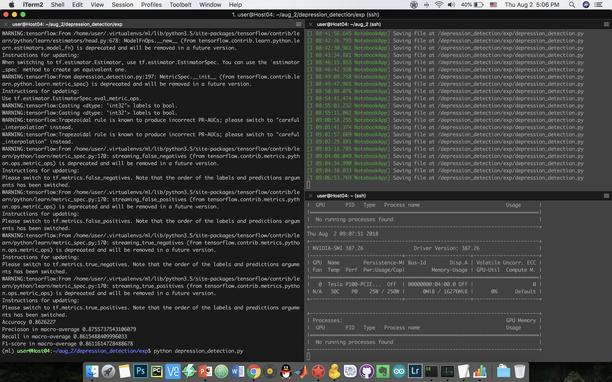

# depression_detection
Depression is a leading cause of disability worldwide.
In clinical diagnosis, psychological doctors often make face-to-face interviews referring to the commonly used Diagnostic and Statistical Manual of Mental Disorders criteria, where nine classes of depression symptoms are defined.

Problem: effective but not proactive.
More than 70% of people in the early stages of depression would not consult the psychological doctors

Popular social media – Facebook, Twitter
User generated contents (UGC)
Emotions and moods
Daily lives & mental states

Advantage:
Proactive care
Depression behaviors
etc..
# Results

  

